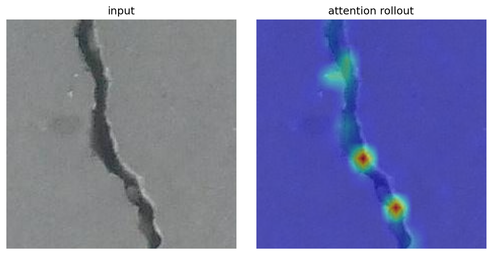
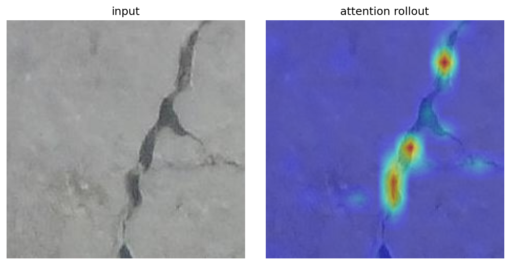

# ViT Defect Inspection

A Vision Transformer (ViT) built from scratch in PyTorch for surface-defect
classification, with attention-rollout visualisation that shows where the model
looks when it flags a crack. The target use case is automated visual inspection,
where a model has to tell an intact surface from a defective one and, ideally,
point at the defect.

[](https://colab.research.google.com/github/bukhorizainun/vit-defect-inspection/blob/main/notebooks/vit_crack_colab.ipynb)

## Why a Vision Transformer

A ViT splits an image into fixed-size patches, embeds each patch, prepends a
class token, and passes the sequence through Transformer encoder blocks. Because
attention is global from the first layer, the model can relate a thin crack on
one side of an image to context on the other side. The attention weights also
give a way to see what the model looks at, which helps when a human inspector
needs to trust the decision.

This repository implements the ViT itself (patch embedding, class token,
positional embeddings, multi-head self-attention, Transformer blocks) instead of
calling a black-box model, so the mechanics are easy to read and change. A
pretrained baseline via [timm](https://github.com/huggingface/pytorch-image-models)
is available for comparison.

## What it does

- Classifies surface images as cracked or intact (any two-class or multi-class
  ImageFolder dataset works).
- Visualises decisions with attention rollout, which highlights the patches that
  drive the prediction, usually the defect region.
- Trains from scratch, or fine-tunes a pretrained ViT with a single flag.

## Repository layout

```
src/
  vit.py         from-scratch Vision Transformer
  attention.py   attention-rollout and overlay visualisation
  data.py        ImageFolder loaders and transforms
  train.py       training and evaluation loop with metrics
tests/
  smoke_test.py  offline check (random data, no download)
notebooks/
  vit_crack_colab.ipynb   end-to-end training on Colab
```

## Quickstart

Colab: open the notebook with the badge above. It clones this repo, downloads the
public Surface Crack dataset, trains the ViT, and renders attention maps.

Local:

```bash
pip install -r requirements.txt

# offline sanity check, no dataset needed
python -m tests.smoke_test

# train on an ImageFolder dataset with Positive and Negative subfolders
python -m src.train --data-dir /path/to/surface_crack --epochs 15

# or fine-tune a pretrained ViT
python -m src.train --data-dir /path/to/surface_crack --pretrained --epochs 5
```

## Results

Trained on the [Surface Crack Detection dataset](https://www.kaggle.com/datasets/arunrk7/surface-crack-detection)
(around 40k images, 227x227, Positive and Negative). Numbers are filled in from
the Colab run.

| Model | Params | Val accuracy |
|-------|-------:|-------------:|
| ViT (from scratch, depth 6) | ~2.9M | 99.8% |
| ViT-tiny (pretrained, timm) | ~5.7M | _to be added_ |

Trained for 15 epochs on Colab (T4 GPU). The from-scratch ViT reaches ~99.8%
validation accuracy; the Surface Crack task is visually easy, so the point of
the project is the from-scratch implementation and the attention-rollout maps
that localise the crack, not the headline number.

Attention rollout on held-out cracked images. The model is trained only with
image-level labels (cracked or intact), yet its attention lands on the crack
itself, which is what makes it useful for inspection.




## Dataset

Surface Crack Detection by C. F. Ozgenel, mirrored on Kaggle
(`arunrk7/surface-crack-detection`). The dataset is downloaded at runtime and is
not stored in this repository.

## License

MIT, see [LICENSE](LICENSE).
